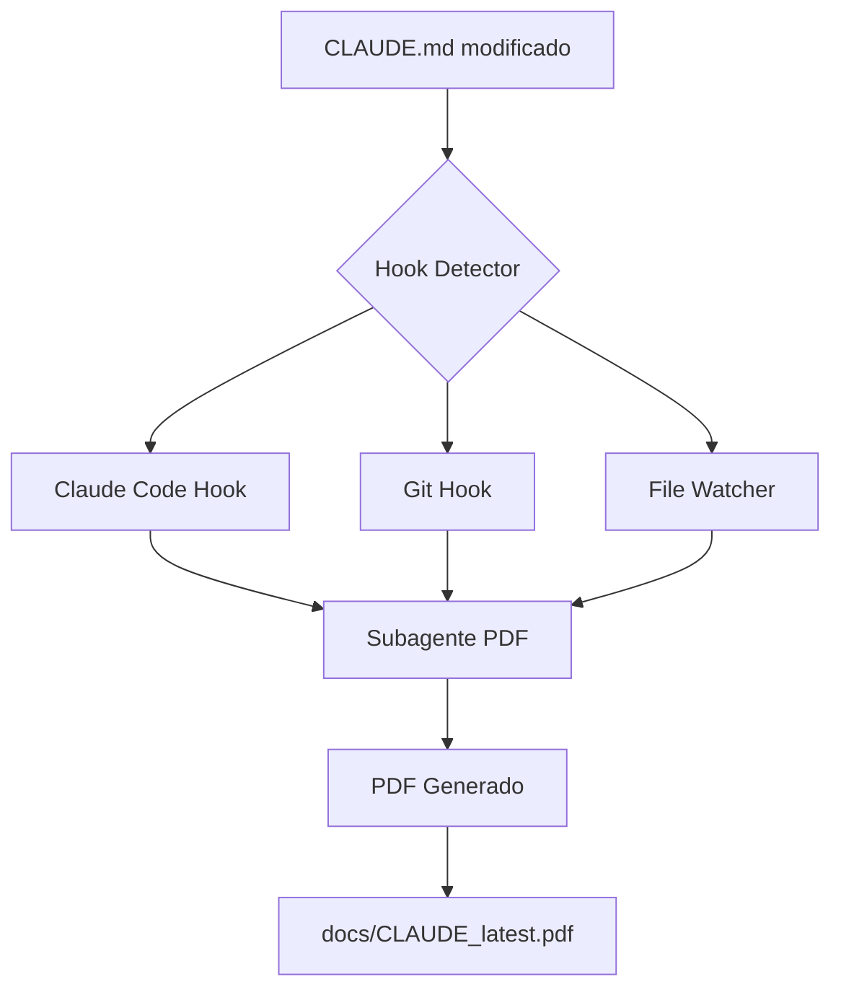

# 🪝 Sistema de Hooks para Generación Automática de PDFs

## Descripción General
Sistema completo de hooks que detecta cambios en `CLAUDE.md` y automáticamente regenera la documentación PDF usando el subagente especializado.

## Arquitectura del Sistema



## Componentes

### 1. `claude_md_hook.py` - Hook Principal
Script Python que detecta cambios y coordina la generación de PDFs.

**Características:**
- ✅ Detección de cambios por hash SHA256
- ✅ Estado persistente en `.claude_md_state.json`
- ✅ Integración con subagente PDF
- ✅ Múltiples modos de operación

**Modos de Operación:**
```bash
# Verificar una vez
python3 claude_md_hook.py --once

# Modo observador continuo
python3 claude_md_hook.py --watch --interval 5

# Ver estado actual
python3 claude_md_hook.py --status

# Instalar hooks del sistema
python3 claude_md_hook.py --install-hooks
```

### 2. Hooks de Claude Code

**Ubicación:** `.claude/hooks/post-edit.sh`

Se ejecuta automáticamente cuando Claude Code edita archivos:
```bash
#!/bin/bash
if [[ "$1" == *"CLAUDE.md"* ]]; then
    python3 claude_md_hook.py --once --output docs/CLAUDE_latest.pdf &
fi
```

### 3. Git Hooks

#### Post-commit Hook
**Ubicación:** `.git/hooks/post-commit`

Regenera PDF después de cada commit que incluya CLAUDE.md:
```bash
if git diff-tree --no-commit-id --name-only -r HEAD | grep -q "CLAUDE.md"; then
    python3 claude_md_hook.py --once --output docs/CLAUDE_latest.pdf
fi
```

#### Pre-push Hook
**Ubicación:** `.git/hooks/pre-push`

Asegura que el PDF esté actualizado antes de push:
```bash
if python3 claude_md_hook.py --status | grep -q "has_changed"; then
    python3 claude_md_hook.py --once --output docs/CLAUDE_latest.pdf
    git add docs/CLAUDE_latest.pdf
    git commit -m "🤖 Auto-update PDF documentation"
fi
```

## Instalación

### Método Automático
```bash
# Hacer ejecutable el instalador
chmod +x install_hooks.sh

# Ejecutar instalador
./install_hooks.sh
```

El instalador:
1. Verifica dependencias
2. Configura permisos
3. Instala hooks de Claude Code
4. Instala Git hooks
5. Crea estructura de directorios
6. Opcionalmente configura cron y VS Code
7. Ejecuta test inicial

### Método Manual
```bash
# 1. Dar permisos de ejecución
chmod +x claude_md_hook.py
chmod +x subagent_pdf_generator.py

# 2. Instalar hooks específicos
python3 claude_md_hook.py --install-hooks

# 3. Crear directorio para PDFs
mkdir -p docs/generated
```

## Flujo de Trabajo

### Escenario 1: Edición con Claude Code
1. Usuario pide a Claude editar CLAUDE.md
2. Claude modifica el archivo
3. Hook post-edit detecta el cambio
4. Invoca subagente PDF en background
5. PDF generado en `docs/CLAUDE_latest.pdf`

### Escenario 2: Commit Manual
1. Usuario edita CLAUDE.md localmente
2. Hace `git add` y `git commit`
3. Git post-commit hook se activa
4. Regenera PDF automáticamente
5. Notifica al usuario

### Escenario 3: Monitoreo Continuo
1. Usuario ejecuta `python3 claude_md_hook.py --watch`
2. Script verifica cada 5 segundos
3. Detecta cambio por hash
4. Genera nuevo PDF con timestamp
5. Actualiza estado persistente

## Estado Persistente

El archivo `.claude_md_state.json` mantiene:
```json
{
  "last_hash": "sha256_hash_del_archivo",
  "last_modified": "2024-01-15T10:30:00",
  "last_pdf_generated": "CLAUDE_documentation_20240115_103000.pdf",
  "generation_count": 5
}
```

## Configuración Avanzada

### Cron Job (Linux/Mac)
Para verificación cada 30 minutos:
```bash
*/30 * * * * cd /path/to/project && python3 claude_md_hook.py --once
```

### Systemd Service (Linux)
```ini
[Unit]
Description=Claude MD Watcher
After=network.target

[Service]
Type=simple
ExecStart=/usr/bin/python3 /path/to/claude_md_hook.py --watch
Restart=always

[Install]
WantedBy=multi-user.target
```

### VS Code Task
`.vscode/tasks.json`:
```json
{
    "label": "Generate PDF from CLAUDE.md",
    "type": "shell",
    "command": "python3",
    "args": ["claude_md_hook.py", "--once"],
    "group": {"kind": "build", "isDefault": true}
}
```

## Personalización

### Cambiar Archivo Observado
```bash
python3 claude_md_hook.py --watch --file README.md
```

### Cambiar Intervalo de Verificación
```bash
python3 claude_md_hook.py --watch --interval 10  # 10 segundos
```

### Especificar Nombre de Salida
```bash
python3 claude_md_hook.py --once --output mi_documento.pdf
```

## Debugging

### Ver Logs Detallados
```bash
# Verificar estado actual
python3 claude_md_hook.py --status

# Ver contenido del estado
cat .claude_md_state.json

# Verificar si hay cambios pendientes
python3 -c "from claude_md_hook import ClaudeMDWatcher; w = ClaudeMDWatcher(); print(w.has_changed())"
```

### Problemas Comunes

| Problema | Solución |
|----------|----------|
| Hook no se ejecuta | Verificar permisos con `ls -la .claude/hooks/` |
| PDF no se genera | Verificar que `subagent_pdf_generator.py` existe |
| Git hook no funciona | Asegurar que el hook sea ejecutable: `chmod +x .git/hooks/*` |
| Estado corrupto | Eliminar `.claude_md_state.json` y reiniciar |

## Integración con CI/CD

### GitHub Actions
```yaml
name: Generate PDF Documentation
on:
  push:
    paths:
      - 'CLAUDE.md'
jobs:
  generate-pdf:
    runs-on: ubuntu-latest
    steps:
      - uses: actions/checkout@v2
      - uses: actions/setup-python@v2
      - run: pip install reportlab
      - run: python3 claude_md_hook.py --once --output docs/CLAUDE.pdf
      - uses: actions/upload-artifact@v2
        with:
          name: documentation
          path: docs/CLAUDE.pdf
```

## Mejores Prácticas

1. **Versionado de PDFs**: Incluir timestamp en el nombre
2. **Limpieza**: Ejecutar limpieza periódica de PDFs antiguos
3. **Caché**: El estado persistente evita regeneraciones innecesarias
4. **Background**: Usar `&` en hooks para no bloquear operaciones
5. **Notificaciones**: Agregar notificaciones del sistema cuando se genera PDF

## Extensiones Futuras

- 🔄 Webhook para notificaciones Slack/Discord
- 📊 Dashboard web con historial de generaciones
- 🎨 Templates personalizables para PDFs
- 🔍 Diff visual entre versiones de PDF
- 🌐 Integración con servicios cloud (S3, Drive)
- 📱 App móvil para visualizar documentación

## Conclusión

El sistema de hooks proporciona automatización completa para mantener la documentación PDF sincronizada con los cambios en CLAUDE.md. La arquitectura modular permite fácil extensión y personalización según las necesidades del proyecto.

---
*Sistema de hooks creado para el Taller de Claude Code Power Users*