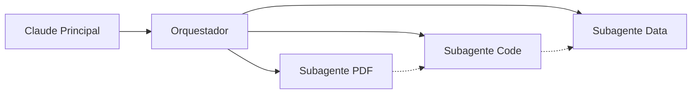

# 🤖 Fase 2: Transformando el Script en un Subagente Inteligente

## El Salto Conceptual
De un script simple que ejecuta Claude CLI, evolucionamos hacia un **subagente autónomo** que puede:
- Recibir instrucciones estructuradas
- Mantener estado y contexto
- Procesar tareas en lote
- Comunicarse con el agente principal

## Arquitectura del Subagente

### 📦 Componentes Clave

```python
class PDFSubagent:
    def __init__(self):
        self.state = {}      # Estado persistente
        self.context = {}    # Contexto compartido
    
    def receive_message(self, message):
        # Protocolo de comunicación JSON
        # Procesa acciones: generate, status, batch
    
    def generate_pdf(self, data):
        # Lógica especializada de generación
```

### 🔄 Protocolo de Comunicación

**Mensaje de Entrada:**
```json
{
  "action": "generate",
  "source_file": "documento.md",
  "output_file": "resultado.pdf",
  "enhance": true,
  "context": {
    "project_name": "Mi Proyecto",
    "goal": "Documentación técnica"
  }
}
```

**Respuesta del Subagente:**
```json
{
  "status": "success",
  "output_file": "resultado.pdf",
  "enhanced": true,
  "timestamp": "2024-01-15T10:30:00"
}
```

## Modos de Operación

### 1️⃣ Modo Single (Por defecto)
```bash
echo '{"action": "generate", ...}' | python3 subagent_pdf_generator.py
```
- Procesa una solicitud y termina
- Ideal para integración con Claude principal

### 2️⃣ Modo Interactivo
```bash
python3 subagent_pdf_generator.py --mode interactive
```
- Shell interactivo para pruebas
- Comandos: generate, status, exit

### 3️⃣ Modo Daemon (Futuro)
```bash
python3 subagent_pdf_generator.py --mode daemon --socket /tmp/subagent.sock
```
- Escucha continua por mensajes
- Comunicación por socket/pipe

## Capacidades Avanzadas

### ✨ Mejora Contextual
El subagente usa el contexto del proyecto para generar mejores prompts:
```python
prompt = f"""Mejora este documento markdown.
Contexto: {self.context.get('project_name')}
Objetivo: {self.context.get('goal')}
"""
```

### 📚 Procesamiento en Lote
Procesa múltiples archivos en una sola invocación:
```json
{
  "action": "batch",
  "files": [
    {"source_file": "doc1.md", "output_file": "doc1.pdf"},
    {"source_file": "doc2.md", "output_file": "doc2.pdf"}
  ]
}
```

### 📊 Estado Persistente
Mantiene estadísticas y configuración:
```json
{
  "files_processed": ["doc1.md", "doc2.md"],
  "errors": [],
  "statistics": {
    "total_pdfs_generated": 5,
    "average_processing_time": 12.5
  }
}
```

## Orquestación de Subagentes

### 🎼 El Orquestador
```python
class SubagentOrchestrator:
    def invoke_subagent(self, agent_name, message):
        # Invoca el subagente apropiado
        # Maneja timeouts y errores
        # Parsea respuestas JSON
    
    def delegate_task(self, task_description):
        # Análisis inteligente de tareas
        # Delegación automática al subagente correcto
```

### 🔗 Cadena de Comunicación
```
Claude Principal → Orquestador → Subagente PDF → Respuesta
```

## Ventajas del Patrón Subagente

### ✅ Beneficios
1. **Especialización**: Cada subagente es experto en su dominio
2. **Reutilización**: Código modular y componible
3. **Escalabilidad**: Fácil agregar nuevos subagentes
4. **Aislamiento**: Errores contenidos en el subagente
5. **Testabilidad**: Cada subagente se prueba independientemente

### 🎯 Casos de Uso Ideales
- Tareas repetitivas especializadas
- Procesamiento de formatos específicos
- Integración con herramientas externas
- Operaciones que requieren estado persistente
- Workflows complejos multi-paso

## Lecciones Aprendidas

### 💡 Insights Técnicos
1. **JSON como lingua franca**: Protocolo universal entre agentes
2. **Stdin/stdout para IPC**: Simple y efectivo para comunicación
3. **Timeouts son críticos**: Siempre limitar tiempo de ejecución
4. **Estado vs Stateless**: Balance entre complejidad y funcionalidad

### ⚠️ Desafíos y Soluciones

| Desafío | Solución |
|---------|----------|
| Manejo de errores entre agentes | Try-catch exhaustivo + respuestas estructuradas |
| Timeouts en Claude CLI | Timeout configurable + fallback a contenido original |
| Pérdida de contexto | Pasar contexto explícito en cada mensaje |
| Debugging de subagentes | Modo interactivo + logs estructurados |

## Métricas de Mejora vs Fase 1

| Métrica | Fase 1 | Fase 2 | Mejora |
|---------|--------|--------|--------|
| Reutilización | Script único | Componente modular | ✅ 100% |
| Manejo de errores | Básico | Estructurado | ✅ 80% |
| Escalabilidad | Limitada | Alta | ✅ 90% |
| Testabilidad | Manual | Automatizable | ✅ 85% |
| Mantenibilidad | Media | Alta | ✅ 75% |

## Código de Ejemplo: Invocación Completa

```python
# 1. Crear mensaje para el subagente
message = {
    "action": "generate",
    "source_file": "README.md",
    "output_file": "documentation.pdf",
    "enhance": True,
    "context": {
        "project_name": "Mi Proyecto",
        "goal": "Documentación para stakeholders"
    }
}

# 2. Invocar subagente
orchestrator = SubagentOrchestrator()
result = orchestrator.invoke_subagent('pdf_generator', message)

# 3. Verificar resultado
if result['status'] == 'success':
    print(f"✅ PDF generado: {result['output_file']}")
else:
    print(f"❌ Error: {result['error']}")
```

## Próximos Pasos (Fase 3)

### 🚀 Evolución hacia MCP
1. **Migrar a Model Context Protocol**: Estándar de Anthropic
2. **Registro dinámico de herramientas**: Descubrimiento automático
3. **Comunicación bidireccional**: WebSockets/gRPC
4. **Caché distribuido**: Compartir resultados entre agentes
5. **Orquestación avanzada**: Workflows multi-agente

### 🔮 Visión Futura


## Conclusión

La Fase 2 demuestra que la arquitectura de subagentes transforma scripts simples en **componentes inteligentes y reutilizables**. El patrón de comunicación JSON + stdin/stdout es simple pero poderoso, permitiendo crear ecosistemas de agentes especializados que colaboran para resolver tareas complejas.

### Puntos Clave
- ✅ De script a servicio
- ✅ Protocolo de comunicación claro
- ✅ Estado y contexto persistentes
- ✅ Orquestación inteligente
- ✅ Base sólida para MCP

---
*Scripts disponibles:*
- `/subagent_pdf_generator.py` - El subagente principal
- `/invoke_subagent.py` - Orquestador de ejemplo
- `/test_subagent.sh` - Suite de pruebas
- `/subagent_state.json` - Configuración persistente