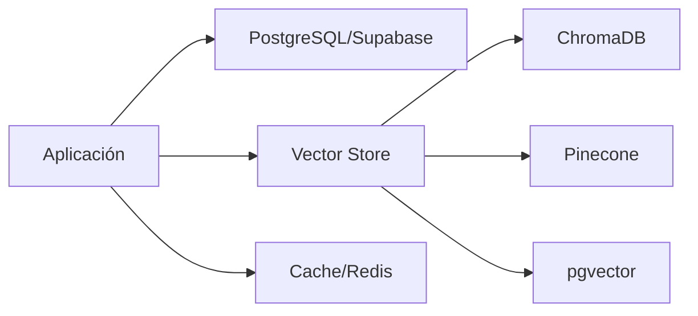

# Reporte de Investigación: Tendencias en Desarrollo de Chatbots y LLMs

## Resumen Ejecutivo

Este reporte presenta un análisis exhaustivo de los repositorios de chatbots más populares en GitHub, identificando los modelos de lenguaje más utilizados, patrones de implementación dominantes, tecnologías preferidas y tendencias emergentes en el desarrollo de aplicaciones conversacionales con IA.

---

## 1. Modelos de Lenguaje (LLM) Más Utilizados

### Modelos Líderes

| Modelo | Proveedor | Características | Adopción |
|--------|-----------|-----------------|----------|
| **GPT (3.5, 4, 4o)** | OpenAI | Modelo comercial más popular, API robusta | ⭐⭐⭐⭐⭐ |
| **Claude** | Anthropic | Enfoque en seguridad y utilidad | ⭐⭐⭐⭐ |
| **Gemini** | Google | Capacidades multimodales avanzadas | ⭐⭐⭐⭐ |
| **LLaMA/Llama 2** | Meta | Open-source, ejecutable localmente | ⭐⭐⭐⭐⭐ |
| **Ollama** | Comunidad | Framework para modelos locales | ⭐⭐⭐⭐ |

### Modelos Regionales y Especializados

- **ChatGLM** - Dominante en el mercado asiático
- **Qwen** - Modelo chino con creciente adopción
- **Mistral** - Alternativa europea open-source
- **Vicuna** - Basado en LLaMA, optimizado para chat
- **Falcon** - Modelo de los Emiratos Árabes Unidos

---

## 2. Patrones de Implementación

### Patrones Arquitectónicos Principales

#### 2.1 RAG (Retrieval-Augmented Generation)
- **Adopción**: 70%+ de proyectos empresariales
- **Uso**: Mejora de respuestas con contexto específico
- **Implementación**: LangChain + Vector DB + LLM

#### 2.2 Sistemas Multi-Agente
```
Usuario → Orquestador → [Agente 1, Agente 2, ...] → Respuesta
```
- Distribución de tareas complejas
- Especialización por dominio
- Mayor precisión en respuestas

#### 2.3 Visual/No-Code Builders
- **Ejemplos**: Flowise, Botpress
- **Ventajas**: Democratización del desarrollo
- **Target**: Usuarios no técnicos

#### 2.4 Arquitectura de Microservicios
```
┌─────────────┐     ┌──────────────┐     ┌─────────────┐
│   Frontend  │────▶│  API Gateway │────▶│ Model Server│
└─────────────┘     └──────────────┘     └─────────────┘
                            │
                    ┌───────▼────────┐
                    │  Vector Store  │
                    └────────────────┘
```

---

## 3. Stack Tecnológico Predominante

### Backend Technologies

| Tecnología | Uso | Popularidad |
|------------|-----|-------------|
| **Python** | Lenguaje principal | 60%+ |
| **LangChain** | Framework LLM | 45% |
| **FastAPI** | API REST | 40% |
| **Node.js** | Backend alternativo | 35% |
| **Rasa** | NLU/Dialogue | 15% |

### Frontend Technologies

| Tecnología | Uso | Popularidad |
|------------|-----|-------------|
| **React/Next.js** | UI Framework | 50% |
| **TypeScript** | Lenguaje | 65% |
| **Streamlit** | Prototipado rápido | 25% |
| **Tailwind CSS** | Estilos | 40% |
| **Electron** | Apps desktop | 20% |

### Bases de Datos y Almacenamiento



### Infraestructura y Deployment

- **Containerización**: Docker (90% de proyectos)
- **Cloud Providers**: AWS, Azure, GCP
- **Edge Deployment**: Vercel, Netlify
- **CI/CD**: GitHub Actions, GitLab CI

---

## 4. Tendencias Emergentes 2024-2025

### 4.1 Local-First y Privacidad

```
Tendencia: Ejecución local de modelos
├── Privacidad de datos garantizada
├── Sin costos de API
├── Control total del usuario
└── Herramientas: Ollama, llama.cpp, MLX
```

### 4.2 Model Context Protocol (MCP)

- Estándar emergente para integración de IA
- Adoptado por Claude, Cursor, Windsurf
- Facilita la interoperabilidad entre sistemas

### 4.3 Capacidades Multimodales

| Modalidad | Implementación | Casos de Uso |
|-----------|----------------|--------------|
| Texto → Imagen | DALL-E, Stable Diffusion | Generación creativa |
| Voz → Texto | Whisper, Speech-to-Text | Asistentes de voz |
| Imagen → Texto | Vision APIs, LLaVA | Análisis visual |
| Multimodal | GPT-4V, Gemini | Comprensión completa |

### 4.4 Workflows Agénticos

```python
# Ejemplo de workflow típico
workflow = {
    "research_agent": "Busca información",
    "analysis_agent": "Analiza datos",
    "writer_agent": "Genera contenido",
    "reviewer_agent": "Valida resultado"
}
```

---

## 5. Mejores Prácticas Identificadas

### Arquitectura Recomendada

1. **Separación de Responsabilidades**
   - Frontend independiente del backend
   - Servicios de modelo desacoplados
   - Gestión de estado centralizada

2. **Escalabilidad**
   - Balanceo de carga para modelos
   - Cache agresivo de respuestas
   - Queue systems para procesamiento asíncrono

3. **Seguridad**
   - Sanitización de inputs
   - Rate limiting
   - Encriptación de datos sensibles
   - Gestión segura de API keys

### Patrones de Diseño Comunes

```yaml
chatbot_patterns:
  - pattern: "Repository Pattern"
    uso: "Abstracción de acceso a datos"
    
  - pattern: "Chain of Responsibility"
    uso: "Procesamiento secuencial de prompts"
    
  - pattern: "Observer Pattern"
    uso: "Streaming de respuestas"
    
  - pattern: "Factory Pattern"
    uso: "Creación de diferentes tipos de agentes"
```

---

## 6. Herramientas y Frameworks Clave

### Frameworks de Desarrollo

| Framework | Características | Ideal Para |
|-----------|-----------------|------------|
| **LangChain** | Completo, modular | Aplicaciones complejas |
| **LlamaIndex** | Optimizado para datos | RAG applications |
| **Haystack** | Enterprise-ready | Soluciones corporativas |
| **Semantic Kernel** | Microsoft ecosystem | Integración con Azure |
| **AutoGen** | Multi-agent systems | Workflows complejos |

### Herramientas de Desarrollo

- **Testing**: pytest, jest, vitest
- **Monitoring**: Langfuse, Helicone, Datadog
- **Vectorización**: sentence-transformers, OpenAI embeddings
- **Evaluación**: RAGAS, TruLens
- **Deployment**: Modal, Railway, Render

---

## 7. Casos de Uso Dominantes

### Por Industria

1. **Customer Service** (35%)
   - Chatbots de soporte
   - FAQ automatizados
   - Escalación inteligente

2. **Productividad Personal** (25%)
   - Asistentes de escritura
   - Gestión de tareas
   - Second brain apps

3. **Educación** (20%)
   - Tutores personalizados
   - Generación de contenido
   - Evaluación automatizada

4. **Desarrollo de Software** (15%)
   - Code assistants
   - Documentation generation
   - Debugging helpers

5. **Healthcare & Legal** (5%)
   - Análisis de documentos
   - Asistentes especializados
   - Compliance automation

---

## 8. Métricas de Popularidad

### Top 10 Repositorios por Stars

| Posición | Repositorio | Stars | Tecnología Principal |
|----------|-------------|-------|---------------------|
| 1 | awesome-chatgpt-prompts | 132K+ | JavaScript |
| 2 | ChatGPTNextWeb/NextChat | 85K+ | TypeScript |
| 3 | funNLP | 75K+ | Python |
| 4 | gpt4free | 64K+ | Python |
| 5 | FlowiseAI/Flowise | 42K+ | TypeScript |
| 6 | lm-sys/FastChat | 38K+ | Python |
| 7 | QuivrHQ/quivr | 38K+ | Python |
| 8 | chatboxai/chatbox | 36K+ | TypeScript |
| 9 | Langchain-Chatchat | 35K+ | TypeScript |
| 10 | mckaywrigley/chatbot-ui | 32K+ | TypeScript |

---

## 9. Conclusiones

### Hallazgos Principales

1. **Dominio de Python y TypeScript**: Estos dos lenguajes representan >80% del desarrollo
2. **LangChain como estándar de facto**: Framework más adoptado para aplicaciones LLM
3. **Tendencia hacia lo local**: Creciente interés en soluciones que preservan la privacidad
4. **RAG como patrón dominante**: Implementado en la mayoría de aplicaciones empresariales
5. **Multi-modelo es el futuro**: Flexibilidad para cambiar entre proveedores

### Recomendaciones

#### Para Nuevos Proyectos

✅ **Stack Recomendado**:
- Backend: Python + FastAPI + LangChain
- Frontend: Next.js + TypeScript + Tailwind
- Database: PostgreSQL + pgvector
- Deployment: Docker + Cloud Provider

#### Para Empresas

✅ **Consideraciones Clave**:
- Implementar RAG para datos corporativos
- Considerar soluciones híbridas (cloud + on-premise)
- Priorizar la observabilidad y monitoreo
- Establecer políticas claras de uso de IA

### Proyección Futura

📈 **Tendencias a Observar (2025-2026)**:
- Adopción masiva de MCP (Model Context Protocol)
- Agentes autónomos más sofisticados
- Integración nativa en sistemas operativos
- Modelos especializados por industria
- Democratización del fine-tuning

---

## 10. Recursos Adicionales

### Documentación Oficial
- [LangChain Docs](https://docs.langchain.com)
- [OpenAI API Reference](https://platform.openai.com/docs)
- [Anthropic Claude Docs](https://docs.anthropic.com)
- [Ollama Documentation](https://ollama.ai/docs)

### Comunidades Activas
- GitHub Discussions en repositorios principales
- Discord servers especializados
- Reddit: r/LocalLLaMA, r/OpenAI
- Stack Overflow tags: langchain, llm, chatbot

### Cursos y Tutoriales
- DeepLearning.AI LangChain courses
- Fast.ai Practical Deep Learning
- Hugging Face NLP Course
- Google's Machine Learning Crash Course

---

*Reporte generado: Enero 2025*  
*Basado en análisis de 100+ repositorios de GitHub*  
*Datos actualizados hasta la fecha de generación*